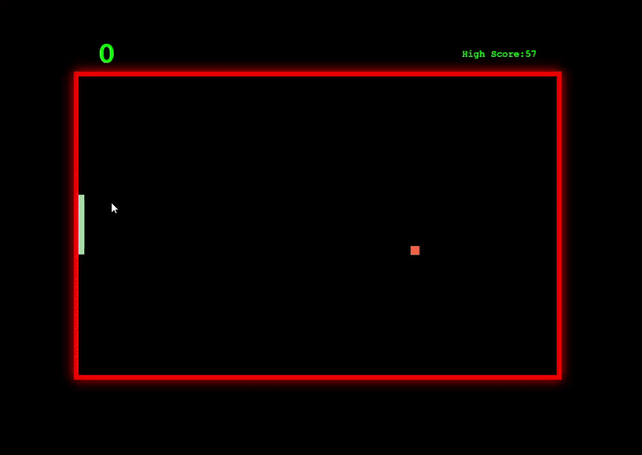
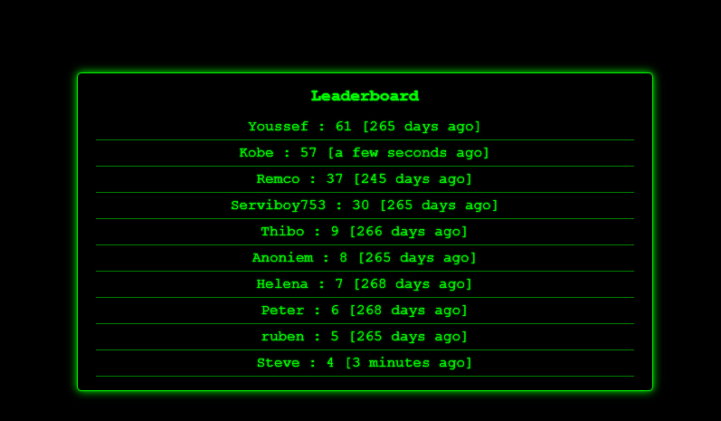

# 🎮 Pong Game

A modern take on the classic Pong game with a retro CRT aesthetic, featuring a global leaderboard system and persistent user scores.


## 🎮 Play Now!

**[Play the game here!](https://pong-9f123.web.app/)**

The game is hosted on Firebase Hosting and everyone is welcome to play. Try to beat the high score and get your name on the global leaderboard!

## 📸 Preview

### Gameplay


### Leaderboard


## 🌟 Features

- **Classic Gameplay**: Single-player Pong with increasing difficulty
- **Retro CRT Aesthetic**: Neon green styling with glowing effects
- **Global Leaderboard**: Real-time leaderboard powered by Firebase
- **Persistent Scores**: Your high score is saved and synced across sessions
- **Touch Support**: Play on mobile devices with touch controls
- **Responsive Design**: Adapts to mobile screens with automatic canvas rotation

## 🎯 How to Play

- **Desktop**: Use ↑ and ↓ arrow keys to control the paddle
- **Mobile**: Touch the left side of the screen to move up, right side to move down
- **Goal**: Keep the ball in play as long as possible - each hit increases your score!

## 🚀 Technologies Used

- **TypeScript**: Type-safe game logic
- **HTML5 Canvas**: Smooth 2D rendering
- **Firebase Realtime Database**: Global leaderboard and score persistence
- **CSS3**: Retro CRT styling with neon effects
- **Vite**: Fast development and build tooling

## 📁 Project Structure

```
├── src/
│   ├── Ball.ts           # Ball physics and movement
│   ├── Pallet.ts         # Paddle control and boundaries
│   ├── Game.ts           # Main game loop and collision detection
│   ├── Rectangle.ts      # Base class for drawable objects
│   ├── LeaderBoard.ts    # Leaderboard management and display
│   ├── DBService.ts      # Firebase integration
│   ├── CookieService.ts  # User session management
│   ├── types.ts          # TypeScript type definitions
│   ├── main.ts           # Application entry point
│   └── style.css         # CRT aesthetic styling
└── index.html
```

## 🎮 Game Mechanics

- **Progressive Difficulty**: Ball speed increases by 10px/s with each successful hit
- **Angle Physics**: Ball bounce angle depends on where it hits the paddle
- **Visual Feedback**: Canvas border changes color (green for hits, red for misses)
- **Score System**: Beat your high score to update the global leaderboard

## 🔧 Setup & Installation

1. Clone the repository
```bash
git clone [your-repo-url]
cd pong-game
```

2. Install dependencies
```bash
npm install
```

3. Run development server
```bash
npm run dev
```

4. Build for production
```bash
npm run build
```

## 🔐 Firebase Configuration

The game uses Firebase Realtime Database for the leaderboard. The configuration is included in `DBService.ts`. For your own deployment, replace the Firebase config with your own project credentials.

## 📱 Mobile Optimization

The game automatically rotates the canvas 90 degrees on mobile devices for a better portrait-mode experience. Touch controls are intuitive: tap left to move up, tap right to move down.

## 🎨 Design Features

- **CRT Monitor Effect**: Green phosphor glow with scan line aesthetics
- **Neon Borders**: Dynamic glowing borders that react to gameplay
- **Retro Typography**: Courier New monospace font for authenticity
- **Real-time Updates**: Leaderboard updates instantly when other players score

## 🏆 Leaderboard System

- Scores are stored with usernames and timestamps
- Real-time synchronization across all players
- Displays time since last score update
- Automatic sorting by highest score

## 📝 License

This project is open source and available under the MIT License.

---

**Enjoy the game and try to top the leaderboard!** 🎯