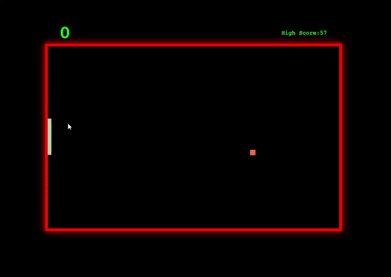
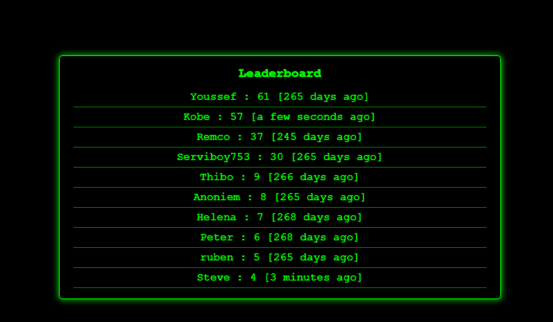

# 🎮 Pong Game

A modern take on the classic Pong game with a retro CRT aesthetic, featuring a global leaderboard system and persistent user scores.


## 🎮 Play Now!

**[Play the game here!](https://pong.kobeerauw.com/)**

The game is hosted on Firebase Hosting and everyone is welcome to play. Try to beat the high score and get your name on the global leaderboard!

## 📸 Preview

### Gameplay


### Leaderboard


## 🌟 Features

- **Classic Gameplay**: Single-player Pong with increasing difficulty
- **Retro CRT Aesthetic**: Neon green styling with glowing effects
- **Global Leaderboard**: Real-time leaderboard powered by Firebase
- **Persistent Scores**: Your high score is saved and synced across sessions
- **Touch Support**: Play on mobile devices by touching or dragging on the playing field
- **Responsive Design**: The playing field scales to fit any screen and rotates on portrait screens

## 🎯 How to Play

- **Desktop**: Use ↑ and ↓ arrow keys to control the paddle
- **Mobile**: Touch or drag on the playing field; the paddle moves to where your finger is
- **Goal**: Keep the ball in play as long as possible - each hit increases your score!

## 🚀 Technologies Used

- **TypeScript**: Type-safe game logic
- **HTML5 Canvas**: Smooth 2D rendering
- **Firebase Realtime Database**: Global leaderboard and score persistence
- **CSS3**: Retro CRT styling with neon effects
- **Vite**: Fast development and build tooling

## 📁 Project Structure

```
├── src/
│   ├── Ball.ts           # Ball physics and movement
│   ├── Pallet.ts         # Paddle control and boundaries
│   ├── Game.ts           # Main game loop and collision detection
│   ├── Rectangle.ts      # Base class for drawable objects
│   ├── LeaderBoard.ts    # Leaderboard management and display
│   ├── DBService.ts      # Firebase integration
│   ├── CookieService.ts  # User session management
│   ├── types.ts          # TypeScript type definitions
│   ├── world.ts          # Playing field dimensions
│   ├── main.ts           # Application entry point
│   └── style.css         # CRT aesthetic styling
└── index.html
```

## 🎮 Game Mechanics

- **Progressive Difficulty**: Ball speed increases by 10px/s with each successful hit
- **Angle Physics**: Ball bounce angle depends on where it hits the paddle
- **Visual Feedback**: Canvas border changes color (green for hits, red for misses)
- **Score System**: Beat your high score to update the global leaderboard

## 🔧 Setup & Installation

1. Clone the repository
```bash
git clone https://github.com/Kobe-Erauw/pong
cd pong
```

2. Install dependencies
```bash
npm install
```

3. Run development server
```bash
npm run dev
```

4. Build for production
```bash
npm run build
```

## 🔐 Firebase Configuration

The game uses Firebase Realtime Database for the leaderboard. The configuration is included in `DBService.ts`. For your own deployment, replace the Firebase config with your own project credentials.

## 📱 Mobile Optimization

The playing field always fits on screen, without scrolling. On a portrait screen it is drawn rotated 90 degrees (paddle at the bottom) so it uses the full height; in landscape it is shown as on desktop. Rendering uses the device's pixel ratio, so it stays sharp on high-DPI screens. Touch the playing field to move the paddle to your finger (it moves at the same speed as with the keyboard, so scores stay comparable). Swipe outside the playing field to scroll to the leaderboard.

## 🎨 Design Features

- **CRT Monitor Effect**: Green phosphor glow with scan line aesthetics
- **Neon Borders**: Dynamic glowing borders that react to gameplay
- **Retro Typography**: Courier New monospace font for authenticity
- **Real-time Updates**: Leaderboard updates instantly when other players score

## 🏆 Leaderboard System

- Scores are stored with usernames and timestamps
- Real-time synchronization across all players
- Displays time since last score update
- Automatic sorting by highest score

## 📝 License

This project is open source and available under the MIT License.

---

**Enjoy the game and try to top the leaderboard!** 🎯
